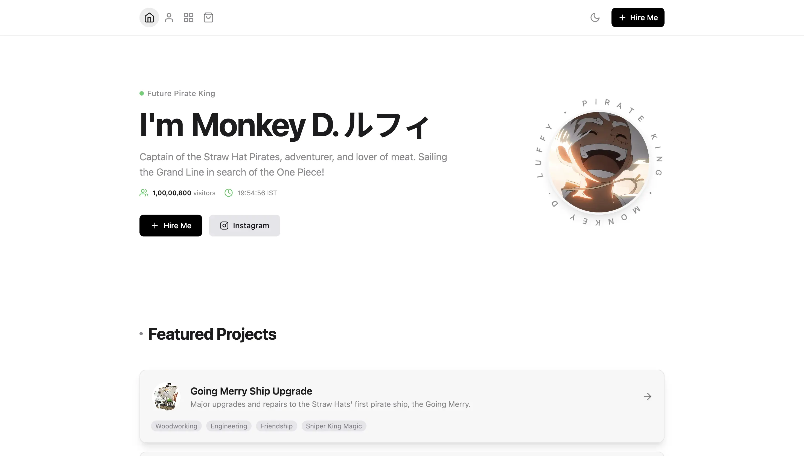
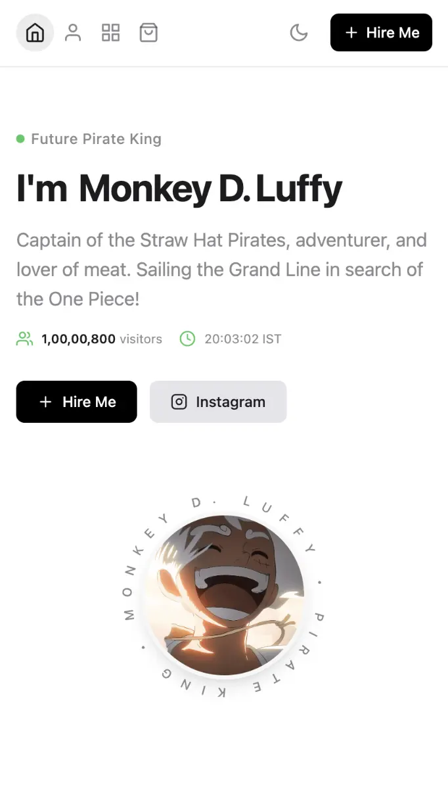

# Luffy Portfolio Template

Una plantilla de portafolio para desarrolladores de código abierto (React + TypeScript + Tailwind) con un divertido tema de demostración de One Piece. Fórkealo, reemplaza el contenido de Luffy con el tuyo y lánzalo.

<p align="center">
  
  &nbsp;&nbsp;
  
</p>

<p align="center">
  <em>Vistas previas de la página principal en escritorio y móvil — tema claro</em>
</p>

## Características

- Diseño responsive (inicio, acerca de, proyectos, productos, contratar)
- Tema claro / oscuro con transición suave de arriba a abajo
- Desplazamiento suave con Lenis
- Páginas de detalle de producto + métricas opcionales de Play Store
- Reloj en tiempo real en hora IST + indicador de estado en línea
- Contador opcional de visitantes con Firebase
- Formulario de contacto vía Web3Forms
- Gráfico de contribuciones de GitHub
- Animación de introducción, sonidos de clic, navegación por deslizamiento en móvil

## Inicio rápido

```bash
git clone https://github.com/anand-reddi/luffy-portfolio.git
cd luffy-portfolio
npm install
npm run dev
```

Abre la URL local que imprime Vite (normalmente `http://localhost:5173`).

## Personalización para tu portafolio

### 1. Contenido personal — `constants.ts`

Actualiza:

- `PERSONAL_INFO` — nombre, título, biografía, correo electrónico, imágenes, texto de "acerca de", nombre de usuario de GitHub
- `PERSONAL_INFO.animatedNameEnglish` / `animatedNameJapanese` — intercambio de nombre en **inicio**, **Acerca de "Soy Yo"** y **pie de página** únicamente (los párrafos permanecen sin cambios)
- `PERSONAL_INFO.circularText` / `circularTextLetterSpacing` — texto giratorio alrededor de la foto de perfil
- `PERSONAL_INFO.introLetter1` / `introLetter2` / `introTagline` — pantalla de apertura (dos letras + eslogan inferior)
- `VISITOR_STATS` — número estático de visitantes (en vivo opcional)
- `PROJECTS` — proyectos principales
- `SIDE_PROJECTS` — productos / proyectos secundarios (opcional: `playStoreStats`, `overview`, `images`, etc.)
- `SOCIAL_LINKS` — enlaces a Instagram / LinkedIn / GitHub
- `SKILLS` — insignias de la pila tecnológica
- `WEB3FORMS_ACCESS_KEY` — tu clave de [web3forms.com](https://web3forms.com)

### 2. Imágenes — `assets/`

Reemplaza las imágenes de demostración (o las URLs remotas en `constants.ts`) con las tuyas. Importa archivos locales así:

```ts
import profile from "./assets/my-profile.webp";
```

### 3. Marca

- `index.html` — título + favicon
- `components/IntroAnimation.tsx` — letras de introducción / eslogan
- El intercambio del idioma del nombre se controla únicamente mediante `PERSONAL_INFO.animatedNameEnglish` / `animatedNameJapanese` en `constants.ts`

### 4. Conteo de visitantes (estático por defecto)

Edita en `constants.ts`:

```ts
export const VISITOR_STATS = {
  staticCount: 10800, // mostrado por defecto
  enableLiveCount: false, // establece true solo después de tu configuración de Firebase
};
```

No se requieren claves de Firebase para la demostración de la plantilla.

**Conteo en vivo:** establece `enableLiveCount: true`, copia `.env.example` → `.env` con **tu** configuración web de Firebase, crea Firestore y luego sigue `VISITOR_COUNTER_SETUP.md`.

## Scripts

| Comando           | Descripción                  |
| ----------------- | ---------------------------- |
| `npm run dev`     | Desarrollo local             |
| `npm run build`   | Compilación para producción → `dist/`   |
| `npm run preview` | Vista previa de la compilación para producción |

## Despliegue

Compila con `npm run build` y luego aloja `dist/` en Firebase Hosting, Vercel, Netlify o GitHub Pages.

## Licencia

MIT — úsala libremente para portafolios personales o comerciales. Mantén la atribución en el pie de página si es posible (UI inspirada en Nur Praditya / Subtle Folio).

## Créditos

- Plantilla y tema de demostración mantenidos a partir de la bifurcación del portafolio de Luffy
- Desarrollado por: [Anand Krishna (@krishhnahere)](https://instagram.com/krishhnahere)
- Inspiración del diseño UI: [Subtle Folio](https://dribbble.com/shots/22110108-Subtle-Folio-Portfolio-Framer-Template) por Nur Praditya
